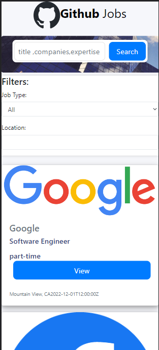
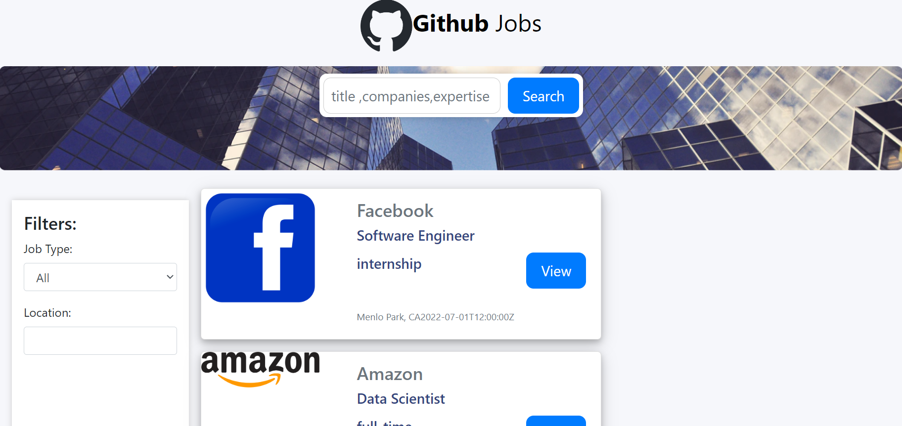

<div align="center">
      <h1> <br/>GitHub Jobs  </h1></div>

<div align="center">
   solución para el  challenge de replicar la pagina Github Jobs <a href="http://devchallenges.io" target="_blank">Devchallenges.io</a>.
</div>

## Descripción

<div align="center">
  <h3>
    <a href="https://jobs-pipetboy.vercel.app/">
      Demo
    </a>
    <span> | </span>
    <a href="https://devchallenges.io/challenges/TtUjDt19eIHxNQ4n5jps">
      Challenge
    </a>
  </h3>
</div>





### Tecnologias
     
      

## Características

- Puedo buscar trabajos con una palabra clave determinada
- Puedo buscar trabajos con el nombre de una ciudad, código postal u otra ubicación
- Solo puedo buscar un trabajo de tiempo completo 
- Puedo ver una lista de trabajos con su logotipo, nombre de la empresa, ubicación y hora de publicación.
- Cuando selecciono un trabajo, puedo ver las descripciones del trabajo y cómo aplicar como el diseño dado.
- Cuando estoy en la página de detalles del trabajo, puedo volver a la página de búsqueda
- Puedo ver trabajos en diferentes páginas, 5 elementos en cada página

## Como Instalar de manera Local
Para clonar y ejecutar esta aplicación, necesitará [Git](https://git-scm.com) y [Node.js](https://nodejs.org/en/download/) (que viene con [ npm](http://npmjs.com)) instalado en su computadora. Desde su línea de comando:

```bash
# Clone this repository
$ git clone https://github.com/pipetboy2001/Github-Jobs

# Install dependencies
$ npm install

# Run the app
$ npm start
```
## Mi experencia en este challange
Nuevamente otro desafio donde tuve que buscar por mi cuenta otra API que hiciera algo similar a la que me entregban en este caso entregaban la API de https://jobs.github.com/api en este caso debido que es una api descontinuada , entre la busqueda encontre mejor crear un JSON con la informacion 
este trabajo en donde mayor complejidad encontre fue hacer que solo mostraran 5 trabajos y hacer paginas para el resto , asi tambien me tomo por sorpresa la complejidad para una primera vez enfrentandome a lo que es react-router-dom 